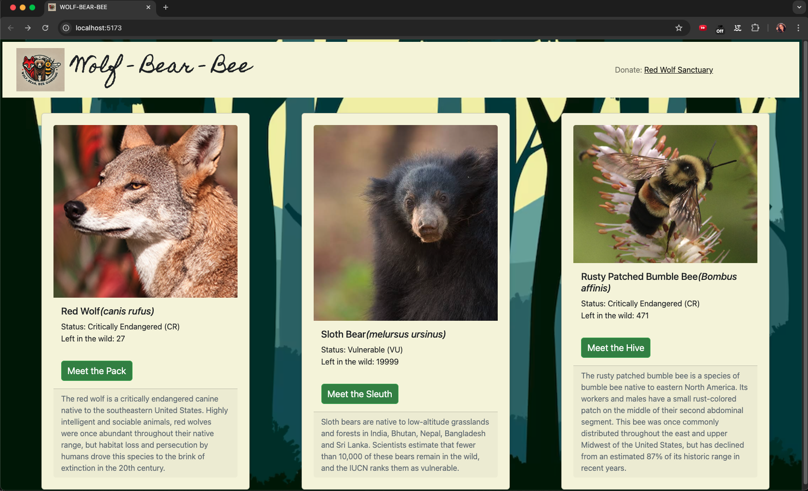

# Wolf-Bear-Bee 

## Project Overview
**Wolf-Bear-Bee ** is a full-stack web application designed to track endangered species, focusing on the Red Wolf, Sloth Bear, and Rusty Patched Bumble Bee. This app allows scientists to track individual animals, add sightings, and monitor their health and status in the wild. The project is built using the PERN stack (PostgreSQL, Express, React, and Node.js).

## Features
- View species, individuals, and sightings in a clean and intuitive UI.
- Add new individuals. 
- Add, edit, and delete sightings.
- Track and monitor health information for individual animals.
- Display sightings with a clickable button for detailed information.
- All forms handled via responsive Bootstrap modals.

## Table of Contents
- [Project Overview](#project-overview)
- [Features](#features)
- [Technologies](#technologies)
- [Setup and Installation](#setup-and-installation)
- [Usage](#usage)
- [API Endpoints](#api-endpoints)
- [Contributing](#contributing)
- [License](#license)

## Technologies
This project was built using the following technologies:
- **Frontend**: React, Bootstrap for UI, Vite
- **Backend**: Node.js, Express
- **Database**: PostgreSQL
- **Testing**: Jest, Supertest & React Testing Libray
- **Styling**: CSS, Bootstrap

## Preview



## Setup and Installation

### Prerequisites
- Node.js (v14 or higher)
- PostgreSQL (v12 or higher)
- Git

### Installation
1. **Clone the repository:**
   ```bash
   git clone git@github.com:MBHunter88/-techtonica-assignments.git
   cd animal-sighting-tracker
   ```

2. **Install server dependencies:**
   ```bash
   cd server
   npm install
   ```

3. **Install client dependencies:**
   ```bash
   cd ../client
   npm install
   ```

4. **Set up the database:**
   - Create a PostgreSQL database using the name `animal_tracking_db`.
   - Run the provided SQL file to set up the tables:
     ```bash
     psql -U your_username -d animal_tracking_db -f ./server/db/db.sql
     ```

5. **Set up environment variables:**
   - Create a `.env` file in the `server` directory with the following details:
     ```
   DB_URI="postgresql://<user>:<password>@localhost/<database>"
     ```

6. **Run the server:**
   ```bash
   cd ../server
   npm start
   ```

7. **Run the client:**
   ```bash
   cd ../client
   npm run dev
   ```

### Running Tests
To run tests, navigate to the server or client directory and use:
```bash
npm test
```

## Usage

### Viewing Species
- Upon page load, the app displays three species in the form of Bootstrap cards. Each card shows the species' common name, scientific name, and a breif description.
  
### Viewing and Adding Individuals
- Each species card has a button that allows users to view tracked individuals for that species. A modal form can be opened to add new individual for the selected species, allowing users to input details such as nickname, who is tracking, and an image.

### Viewing Adding, Editing and Deleting Sightings
- Each individual card has a button that allows users to view sightings for that selected individual. A modal form can be opened to add new sightings for the selected individuals, allowing users to input details such as location, health status, and sighting date. Users can also edit and delete sightings on each sighting card. 

## API Endpoints

### Species Endpoints
- **GET /api/species**: Retrieve all species.

### Individuals Endpoints
- **GET /api/individuals**: Retrieve all individuals.
- **GET /individuals/species/:species**: Get individuals by species. (SQL JOIN query)
- **POST /api/individuals**: Add a new individual.

### Sightings Endpoints
- **GET /api/sightings**: Retrieve all sightings.
- **GET /sightings/species/:species**: Get sightings by individual nickname. (SQL JOIN query)
- **POST /api/sightings**: Add a new sighting.
- **PUT /api/sightings/:sightingId**: Update a sighting.
- **DELETE /api/sightings/:sightingId**: Delete a sighting.

## Contributing
Contributions are welcome! Please follow these steps:
1. Fork the repository.
2. Create a new branch for your feature: `git checkout -b feature-name`.
3. Commit your changes: `git commit -m 'Add new feature'`.
4. Push the branch: `git push origin feature-name`.
5. Create a pull request.

## License
This project is licensed under the MIT License.
